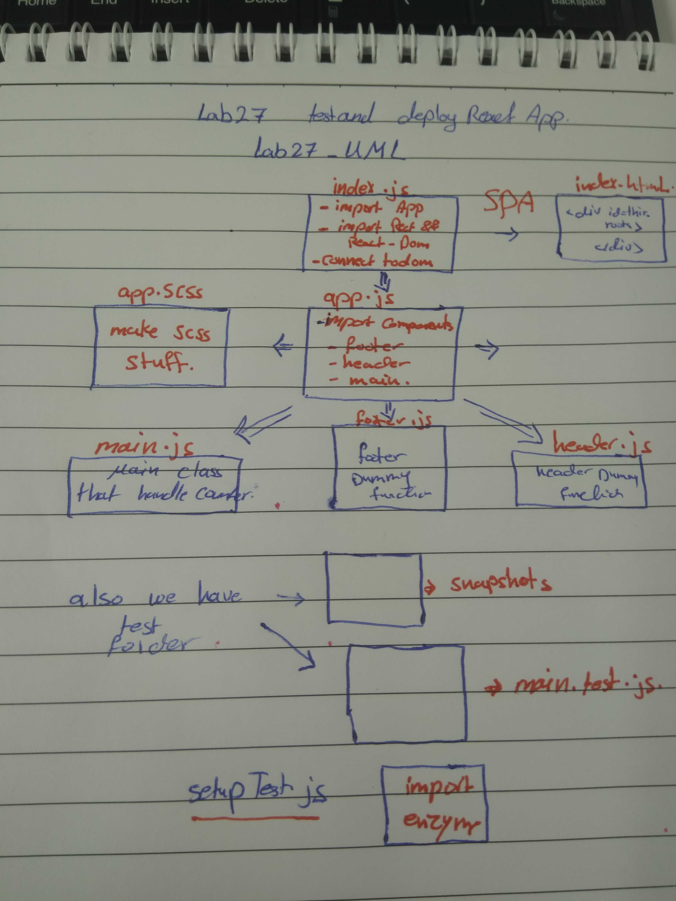

# rect-app-lab27
## Test and Deploy react app

## auther
Mai yusuf

## Available Scripts
In the project directory, you can run:
### to run the app 
npm start

Runs the app in the development mode.
Open http://localhost:3000 to view it in the browser.

The page will reload if you make edits.
You will also see any lint errors in the console.

### to test the app 
npm run test 

## the link of deploy app in the gh-pages
https://401-advanced-javascript-mai.github.io/rect-app-lab27/

## UML

